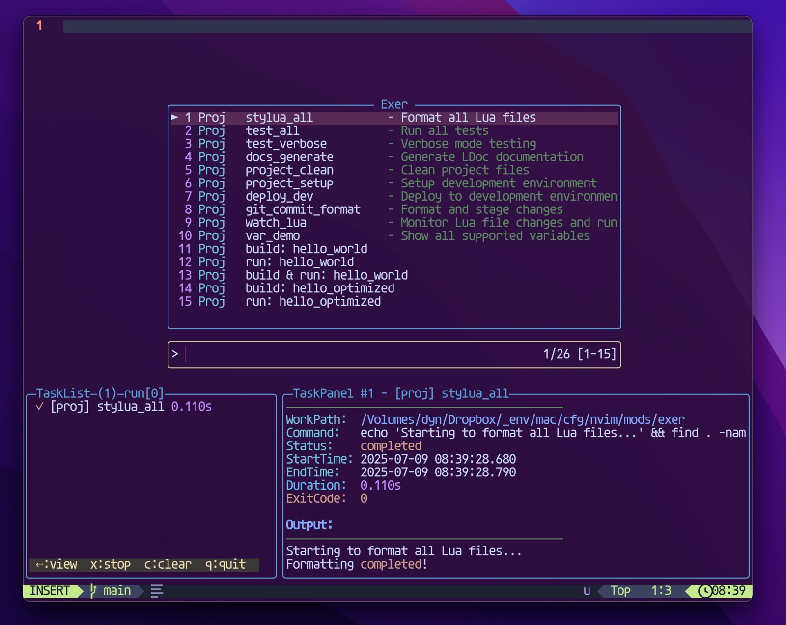

# exer.nvim

A unified multi-language task executor for Neovim.

<p align="center">
	<p align="center">
		
	</p>
</p>


## Features

- **Multi-language support** – Run code across multiple languages through a single interface  
- **Unified task management** – Consistent UI for compiling, executing, and testing  
- **Project-aware configuration** – Auto-detects and runs project-specific tasks  
- **Real-time output** – Live output with ANSI color support  
- **Task navigation** – Smooth window switching between editor and task views (opt-in)  
- **Extensible architecture** – Easily integrate with build tools and test frameworks  


<p align="center">
	<p align="center">
		
	</p>
</p>

## Requirements

- **Neovim** >= 0.10.0
- A [Nerd Font](https://www.nerdfonts.com/) (for proper icon display)  


## Development Status

⚠️ **Work in Progress** – This plugin is under active development and subject to change.

### Compilation System

A unified compilation system for language modules is currently not implemented. The project currently focuses on task execution and does not yet provide integrated compilation workflows.

If you have suggestions for a better compilation system design or would like to contribute ideas, please feel free to open an issue or discussion. We're looking for input on:

- Compilation workflow design
- Integration with existing build tools
- Cross-platform compatibility
- Performance optimization strategies


## Installation

Install with your favorite package manager:

### [lazy.nvim](https://github.com/folke/lazy.nvim)

```lua
-- Option 1: Use default keymaps (automatic)
{
  "RazgrizHsu/exer.nvim",
  config = function()
    require("exer").setup()
  end,
}

-- Option 2: Custom keymaps via keys table
{
  "RazgrizHsu/exer.nvim",
  keys = {
    { "<leader>ro", "<cmd>ExerOpen<cr>", desc = "Open task picker" },
    { "<leader>rr", "<cmd>ExerRedo<cr>", desc = "Re-run last task" },
    { "<leader>rx", "<cmd>ExerStop<cr>", desc = "Stop all running tasks" },
    { "<A-/>", "<cmd>ExerShow<cr>", desc = "Toggle task output window" },
    { "<C-w>t", "<cmd>ExerFocusUI<cr>", desc = "Focus task UI" },
    -- Task navigation (requires enable_navigation = true)
    { "<C-j>", "<cmd>ExerNavDown<cr>", desc = "Task navigation down" },
    { "<C-k>", "<cmd>ExerNavUp<cr>", desc = "Task navigation up" },
    { "<C-h>", "<cmd>ExerNavLeft<cr>", desc = "Task navigation left" },
    { "<C-l>", "<cmd>ExerNavRight<cr>", desc = "Task navigation right" },
  },
  config = function()
    require("exer").setup({
      debug = false,
      enable_navigation = true,  -- Enable <C-hjkl> task navigation
      ui = {
        height = 0.4,
        list_width = 40,
        auto_toggle = false,
        auto_scroll = true,
        keymaps = {
          stop_task = 's',        -- Use 's' instead of 'x' to stop tasks
          clear_task = 'c',       -- Use 'c' to clear current task
          clear_all_completed = 'C', -- Use 'C' to clear all completed tasks
          close_ui = '<Esc>',     -- Use Escape to close UI
          toggle_auto_scroll = 'a' -- Keep default 'a' for auto-scroll
        }
      },
    })
  end,
}

-- Option 3: Disable default keymaps completely
{
  "RazgrizHsu/exer.nvim",
  config = function()
    require("exer").setup({
      disable_default_keymaps = true,
      ui = {
        height = 30,          -- Fixed height: 30 lines
        list_width = 0.25,    -- List width: 25% of editor width
        auto_toggle = true,
        auto_scroll = false,
        keymaps = {
          stop_task = 's',        -- Use 's' instead of 'x' to stop tasks
          clear_task = 'c',       -- Use 'c' to clear current task
          clear_all_completed = 'C', -- Use 'C' to clear all completed tasks
          close_ui = '<Esc>',     -- Use Escape to close UI
          toggle_auto_scroll = 'a' -- Keep default 'a' for auto-scroll
        }
      },
    })
    -- Set your own keymaps
    vim.keymap.set("n", "<leader>er", "<cmd>ExerOpen<cr>", { desc = "Open exer" })
  end,
}
```

## Quick Start

1. Open a source file in Neovim  
2. Press `<leader>ro` to open the task picker  
3. Select a task to execute  
4. View output in the task window  

## Key Bindings

| Key          | Command              | Description                          |
|--------------|----------------------|--------------------------------------|
| `<leader>ro` | `:ExerOpen`          | Open task picker                     |
| `<leader>rr` | `:ExerRedo`          | Re-run the last task                 |
| `<leader>rx` | `:ExerStop`          | Stop all running tasks               |
| `<A-/>`      | `:ExerShow`          | Toggle task output window            |
| `<C-w>t`     | `:ExerFocusUI`       | Focus on task output window          |
| `<C-hjkl>`   | Task Navigation      | Navigate between editor and task UI (requires `enable_navigation = true`) |

### Task Navigation (`<C-hjkl>`)

**Note:** Task navigation is disabled by default. To enable it, set `enable_navigation = true` in your setup.

The task navigation feature provides seamless movement between your editor and the task UI:

- **From editor**:
  - `<C-j>` or `<C-l>` - Move to task UI when it's open
  - `<C-h>` or `<C-k>` - Standard Vim window navigation

- **Within task UI**:
  - `<C-h>` - Move from task panel to task list
  - `<C-l>` - Move from task list to task panel
  - `<C-k>` - Return to editor window
  - `<C-j>` - Return to editor window

**Note**: If you're using vim-tmux-navigator or similar plugins that bind `<C-hjkl>`, exer.nvim will intelligently defer to them when appropriate. The plugin will:
1. First try standard Vim window navigation
2. If that fails and you have tmux-navigator, it will try tmux navigation
3. Finally, if still in the same window and task UI is open, it will navigate to the task UI

To ensure exer.nvim's navigation works properly with vim-tmux-navigator, you can either:
- Load exer.nvim after tmux-navigator (add `dependencies = { "christoomey/vim-tmux-navigator" }` to your config)
- Or disable specific tmux-navigator keymaps that you want exer.nvim to handle

## Configuration

### Plugin Setup Options

| Option | Type | Default | Description |
|--------|------|---------|-------------|
| `debug` | `boolean` | `false` | Enable debug logging |
| `disable_default_keymaps` | `boolean` | `false` | Disable all default keymaps |
| `enable_navigation` | `boolean` | `false` | Enable task navigation keymaps (`<C-hjkl>`) |
| `config_files` | `array` | `nil` | Custom config file search list (see below) |

#### Custom Config Files

By default, exer.nvim searches for configuration files in this order:
1. `proj.toml`
2. `exer.toml`
3. `exer.json`
4. `.exer.toml`
5. `.exer.json`
6. `.exec`
7. `.editorconfig` (with `[exer]` section)
8. `pyproject.toml` (with `[tool.exec]` section)
9. `Cargo.toml` (with `[package.metadata.exec]` section)
10. `package.json` (with `exec` field)

You can override this behavior by specifying your own search list:

```lua
require('exer').setup({
  config_files = {
    "my-tasks.toml",                    -- TOML format
    "my-tasks.json",                    -- JSON format
    "config/exer.toml",                 -- Subdirectory
    ".my-exec",                         -- Hidden file
    "/absolute/path/tasks.json",        -- Absolute path
    {
      path = "Cargo.toml",
      section = "package.metadata.exec"
    },                                  -- Embedded config
    {
      path = "pyproject.toml",
      section = "tool.exec"
    }
  }
})
```

**Options:**
- **String format**: Relative paths are resolved from project root
- **Table format**: Use `path` and `section` for embedded configurations
- **Search order**: Files are searched in the order specified
- **Absolute paths**: Use `/` prefix for absolute paths

### UI Configuration

| Option | Type | Default | Description |
|--------|------|---------|-------------|
| `ui.height` | `number` | `0.3` | UI height. Values 0.0-1.0 = percentage, >1 = fixed lines |
| `ui.list_width` | `number` | `36` | Task list width. Values 0.0-1.0 = percentage, >1 = fixed columns |
| `ui.auto_toggle` | `boolean` | `true` | Automatically open UI when a task starts |
| `ui.auto_scroll` | `boolean` | `true` | Automatically scroll task panel to show latest output |
| `ui.keymaps` | `table` | See below | Custom keymaps for UI interactions |

#### UI Keymaps

| Key | Default | Description |
|-----|---------|-------------|
| `stop_task` | `'x'` | Stop the selected/current task |
| `clear_task` | `'c'` | Clear the current task (completed/failed only) |
| `clear_all_completed` | `'C'` | Clear all completed tasks |
| `close_ui` | `'q'` | Close the task UI |
| `toggle_auto_scroll` | `'a'` | Toggle auto-scroll in task panel |


### Project Configuration

exer.nvim supports project-specific task configuration through configuration files in your project root. Both TOML and JSON formats are supported.

#### Variable System

Use `${variable}` syntax in commands:

**File Variables**
- `${file}` - Full path of current buffer
- `${filename}` - Filename with extension (no path)
- `${name}` - Filename without extension
- `${fullname}` - Full path without extension
- `${ext}` - File extension
- `${filetype}` - Vim filetype value
- `${stem}` - Filename with extension

**Path Variables**
- `${dir}` - Directory of current file
- `${root}` - Project root directory
- `${cwd}` - Current working directory
- `${dirname}` - Current directory name

**System Variables**
- `${servername}` - Vim/Neovim server name


#### Basic Task Configuration

**TOML Format (exer.toml):**
```toml
[exer]
# Single command tasks
acts = [
  {
    id = "run",
    cmd = "python ${file}",
    desc = "Run Python file",
    when = "python"  # Only show for Python files
  },
  {
    id = "compile",
    cmd = "gcc ${name}.c -o ${name}",
    desc = "Compile C file",
    when = "c",
    cwd = "build"    # Execute in build directory
  }
]

# Multi-step commands (sequential)
[[exer.acts]]
id = "build_and_run"
cmd = [
  "gcc ${name}.c -o ${name}",
  "./${name}"
]
desc = "Build and run C program"
env = { DEBUG = "1", CC = "clang" }  # Environment variables

# Parallel execution
[[exer.acts]]
id = "check_all"
cmds = [
  "gcc -fsyntax-only ${file}",
  "cppcheck ${file}"
]
desc = "Run syntax and static analysis in parallel"

# Task references
[[exer.acts]]
id = "compile"
cmd = "gcc ${name}.c -o ${name}"
desc = "Compile C file"

[[exer.acts]]
id = "full_build"
cmd = ["cmd:compile", "echo 'Build complete'"]
desc = "Compile and show status"
```

**JSON Format (exer.json):**
```json
{
  "exer": {
    "acts": [
      {
        "id": "run",
        "cmd": "python ${file}",
        "desc": "Run Python file",
        "when": "python"
      },
      {
        "id": "compile",
        "cmd": "gcc ${name}.c -o ${name}",
        "desc": "Compile C file",
        "when": "c",
        "cwd": "build"
      },
      {
        "id": "build_and_run",
        "cmd": [
          "gcc ${name}.c -o ${name}",
          "./${name}"
        ],
        "desc": "Build and run C program",
        "env": {
          "DEBUG": "1",
          "CC": "clang"
        }
      },
      {
        "id": "check_all",
        "cmds": [
          "gcc -fsyntax-only ${file}",
          "cppcheck ${file}"
        ],
        "desc": "Run syntax and static analysis in parallel"
      },
      {
        "id": "compile",
        "cmd": "gcc ${name}.c -o ${name}",
        "desc": "Compile C file"
      },
      {
        "id": "full_build", 
        "cmd": ["cmd:compile", "echo 'Build complete'"],
        "desc": "Compile and show status"
      }
    ]
  }
}
```


#### Configuration Options

**Task Options (acts)**
- `id` - Unique task identifier (required)
- `cmd` / `cmds` - Command specification (required, see details below)
- `desc` - Task description
- `when` - Filetype condition
- `cwd` - Working directory
- `env` - Environment variables

**Command Execution (`cmd` vs `cmds`)**

Commands can be specified in multiple formats:

```toml
# Single command (string)
{ id = "run", cmd = "python ${file}" }

# Sequential execution - stops on first failure
{ id = "build", cmd = ["gcc main.c -o main", "./main"] }

# Parallel execution - runs all commands simultaneously
{ id = "check", cmds = ["eslint .", "prettier --check ."] }

# Task reference - execute another task
{ id = "test", cmd = "cmd:build" }

# Mixed commands and references
{ id = "full_test", cmd = ["cmd:build", "pytest", "cmd:cleanup"] }
```

**Execution Modes:**
- **`cmd`**: Sequential execution (stops on first failure)
- **`cmds`**: Parallel execution (runs all commands simultaneously)
- **Task references** (`cmd:task_id`): Execute another defined task
- **Mixed arrays**: Combine direct commands and task references

**Task References:**
```toml
[exer]
acts = [
  { id = "build", cmd = "gcc main.c -o main" },
  { id = "run", cmd = "./main" },
  { id = "test", cmd = ["cmd:build", "cmd:run", "echo 'Tests complete'"] }
]
```


#### Complete Example

**TOML Format:**
```toml
[exer]
# Language-specific tasks
acts = [
  # Python
  { id = "run_py", cmd = "python ${file}", desc = "Run Python", when = "python" },
  { id = "test_py", cmd = "pytest ${file} -v", desc = "Test Python", when = "python" },
  
  # JavaScript/TypeScript
  { id = "run_js", cmd = "node ${file}", desc = "Run JS", when = "javascript" },
  { id = "run_ts", cmd = "tsx ${file}", desc = "Run TS", when = "typescript" },
  
  # C/C++
  { id = "compile_c", cmd = "gcc ${file} -o ${name}", desc = "Compile C", when = "c" },
  { id = "compile_cpp", cmd = "g++ ${file} -o ${name}", desc = "Compile C++", when = "cpp" },
  
  # Go
  { id = "run_go", cmd = "go run ${file}", desc = "Run Go", when = "go" },
  { id = "test_go", cmd = "go test ./...", desc = "Test Go", when = "go" }
]

# Project-wide tasks (always available)
[[exer.acts]]
id = "clean"
cmd = "rm -rf build dist"
desc = "Clean build artifacts"

[[exer.acts]]
id = "test_all"
cmd = ["npm test", "go test ./...", "pytest"]
desc = "Run all tests"
```

**JSON Format:**
```json
{
  "exer": {
    "acts": [
      {
        "id": "run_py",
        "cmd": "python ${file}",
        "desc": "Run Python",
        "when": "python"
      },
      {
        "id": "test_py",
        "cmd": "pytest ${file} -v",
        "desc": "Test Python",
        "when": "python"
      },
      {
        "id": "run_js",
        "cmd": "node ${file}",
        "desc": "Run JS",
        "when": "javascript"
      },
      {
        "id": "compile_c",
        "cmd": "gcc ${file} -o ${name}",
        "desc": "Compile C",
        "when": "c"
      },
      {
        "id": "clean",
        "cmd": "rm -rf build dist",
        "desc": "Clean build artifacts"
      },
      {
        "id": "test_all",
        "cmd": ["npm test", "go test ./...", "pytest"],
        "desc": "Run all tests"
      }
    ]
  }
}
```


## Developer Notes

> As a long-time JetBrains user transitioning to Neovim, I found no task executor that matched my workflow.  
> Inspired by the amazing plugins from the community, I decided to build one myself — and thus, *exer.nvim* was born.  
> This project is still evolving, and there's much room for improvement.  
> If it ends up helping even just one person, I'd consider it a success.

## Contributing

Contributions are welcome!  
Feel free to open an issue or submit a pull request.
